# Knowledge-base pipeline diagram (A2)

```mermaid
flowchart LR
    A["data/raw/*.png<br/>page images, 300 DPI"] --> B["ingest/loader.py<br/>Page objects, doc_id via toc.json"]
    B --> C["ingest/preprocess.py<br/>no-op: scans are clean"]
    C --> D{"enhance.enabled?"}
    D -->|"false (A2)"| E["vision/layout.py<br/>1 region single-col / 2 regions two-col"]
    D -->|"true (unused)"| E
    E --> F["vision/ocr.py<br/>loads pre-computed data/ocr_text/*.txt<br/>one Chunk per page"]
    F --> G["index/chunk.py<br/>hybrid: rule-based Plays/Sonnets/Poems<br/>+ semantic Biography"]
    G --> H["index/embed.py<br/>BAAI/bge-m3, 1024-dim, L2-normalized"]
    H --> I["index/store.py<br/>faiss.IndexFlatIP"]
    I --> J[("data/index/<br/>index.faiss + chunk_ids.json + chunks_contract.jsonl")]
```

## What's actually validated vs. still an open confirmation

**Validated (cross-checked by two independently-run full-corpus builds on Kaggle):**
chunk -> embed -> store. Both runs agree almost exactly: 4,774 rule-based chunks in
*both* runs, sonnet count 140/140 in both, a correct top-1 retrieval on a real query in
both. See `codes/A2_form.md` Section 5 for the full evidence.

**Ported into this repo's fixed interface this milestone, OCR engine now confirmed:**
`Qwen/Qwen3-VL-4B-Instruct`, prompted zero-shot per page image (not fine-tuned), produced the
shipped `codes/final_texts/shakespeare-ocr` corpus that `vision/ocr.py` reads — run across 4
Kaggle notebooks (`codes/q3_4B_gt_part1..4.ipynb`, covering page_0001-page_1318). Traditional
OCR engines (Tesseract/PaddleOCR/EasyOCR/docTR) were benchmarked and rejected for catastrophic
accuracy on this corpus's archaic typography — see `notebooks/eda.ipynb` Stage 4. See
`configs/config.yaml`'s `ocr.model`. **Still open:** a saved CER/WER run of the shipped
Qwen3-VL-4B-Instruct output itself against `grading_kit/labels.jsonl` — see `codes/A2_form.md`
Section 3/4's OCR rows.

**A documented assumption, not a detection:** `vision/layout.py`'s single- vs. two-column
call is made per-*category* (Biography/Poem = single column, Comedy/History/Tragedy = two
column), because `data/toc.json` carries no per-page `layout_type` field. Flagged in code for
whoever owns Layout to confirm against the real scans.

**Not built at all yet:** Enhancement (deliberately skipped — scans are clean, see A1 form
Section 2) and everything past Stage 4 (Retrieval, Agent, RL/RLVR, Serve, Eval) — A3/A4 scope.
